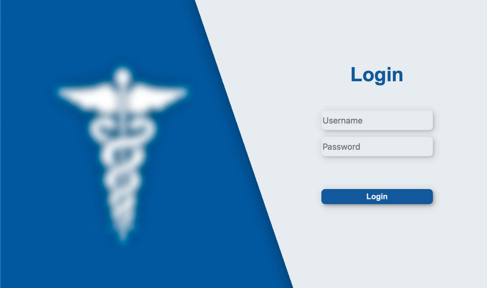
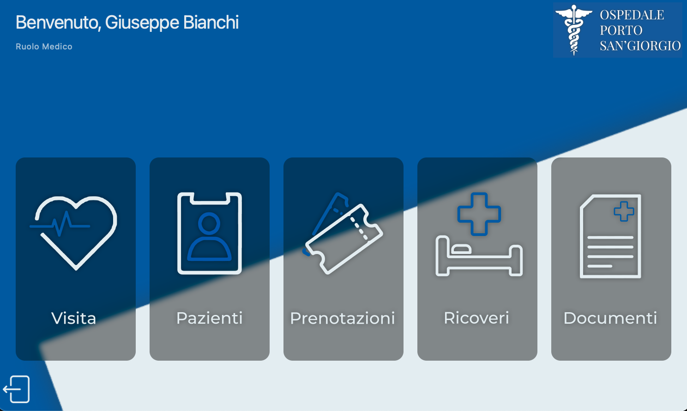

# ProntoCare

**Software gestionale per la gestione interna di un pronto soccorso ospedaliero.**


 &nbsp;&nbsp;   

ProntoCare è un'applicazione sviluppata in **Python** che gestisce le attività interne di un pronto soccorso: dall'accoglienza del paziente all'assegnazione della priorità di triage, fino alla gestione delle visite, dei ricoveri e della documentazione clinica.

Il progetto nasce da un'analisi dei requisiti condotta tramite interviste al personale ospedaliero, con l'obiettivo di semplificare il lavoro quotidiano di infermieri e medici.

---

## Indice

- [Panoramica](#panoramica)
- [Ruoli](#ruoli)
- [Struttura del pronto soccorso](#struttura-del-pronto-soccorso)
- [Codici di triage](#codici-di-triage)
- [Funzionalità](#funzionalità)
- [Documenti ospedalieri](#documenti-ospedalieri)
- [Dati gestiti](#dati-gestiti)
- [Requisiti](#requisiti)
- [Installazione e avvio](#installazione-e-avvio)
- [Accesso al sistema](#accesso-al-sistema)
- [Autore](#autore)

---

## Panoramica

Il sistema svolge esclusivamente funzioni **interne** al pronto soccorso e accompagna l'intero percorso del paziente:

- registrazione delle generalità del paziente;
- assegnazione della priorità di accesso (triage);
- gestione delle prenotazioni di visite e dei ricoveri;
- creazione dei documenti ospedalieri (referto e lettera di dimissioni);
- assistenza nel processo delle cure.

---

## Ruoli

Il sistema prevede tre tipi di utente, gestiti dall'amministratore:

| Ruolo | Responsabilità |
| --- | --- |
| **Amministratore** | Supervisiona l'accesso al sistema e gestisce gli account del personale |
| **Infermiere** | Gestisce i pazienti e le relative prenotazioni |
| **Medico** | Gestisce le visite e gli eventuali ricoveri |

---

## Struttura del pronto soccorso

Il pronto soccorso è suddiviso in due sezioni: **accoglienza** e **ricovero**.

### Accoglienza

All'arrivo, il paziente viene preso in carico da un infermiere che ne verifica la presenza nel sistema. Se non è registrato, l'infermiere crea il profilo inserendo le sue generalità.

Viene quindi creata una **prenotazione** con i sintomi del paziente e una **priorità di accesso** (codice di triage). Il sistema ordina automaticamente la lista delle prenotazioni in base all'urgenza.

Il medico di turno visita il paziente in cima alla lista, effettua un'analisi preliminare e compila un **referto** con la diagnosi. Al termine può:

- **dimettere** il paziente, creando una lettera di dimissioni con le cure da seguire a casa; oppure
- **prenotare un posto letto** nella sezione di ricovero.

I familiari possono rivolgersi a un infermiere per conoscere lo stato del paziente.

### Ricovero

Se necessario, al paziente viene assegnato uno dei **50 posti letto** disponibili e viene sottoposto al trattamento adeguato alla sua condizione. Quando è pronto per la dimissione, il medico valuta le sue condizioni e redige la lettera di dimissioni, liberando così il posto letto.

Se tutti i posti letto sono occupati, il paziente viene trasferito in un'altra struttura sanitaria.

---

## Codici di triage

Le prenotazioni vengono ordinate per urgenza secondo tre codici colore:

| Codice | Urgenza |
| --- | --- |
| 🔴 **Rosso** | Grave |
| 🟡 **Giallo** | Media |
| 🟢 **Verde** | Lieve |

---

## Funzionalità

I requisiti del sistema sono organizzati in cinque macro-categorie.

### Gestione Pazienti
- Registrazione di nuovi pazienti
- Modifica ed eliminazione di pazienti esistenti
- Visualizzazione della lista pazienti e del dettaglio del singolo

### Gestione Visite
- Creazione ed eliminazione delle prenotazioni di visita
- Visualizzazione della lista delle prenotazioni, ordinata per codice di emergenza
- Consultazione delle informazioni di prenotazione durante la visita
- Dimissione del paziente al termine della visita

### Gestione Documentazione
- Creazione e visualizzazione dei documenti ospedalieri (referto e lettera di dimissioni)

### Gestione Ricoveri
- Assegnazione di un posto letto (max 50)
- Visualizzazione della lista dei ricoveri e del dettaglio del singolo
- Dimissione del paziente con conseguente liberazione del posto letto

### Generali
- Gestione e ricerca del personale ospedaliero
- Backup del sistema

---

## Documenti ospedalieri

| Documento | Quando viene creato |
| --- | --- |
| **Referto** | Al termine di una visita, contiene la diagnosi del paziente |
| **Lettera di dimissioni** | Alla dimissione, contiene le cure da effettuare al di fuori della struttura |

---

## Dati gestiti

**Paziente:** nome, cognome, codice fiscale, sesso, data di nascita, luogo di nascita, numero di telefono, residenza.

**Personale:** nome, cognome, codice fiscale, username, password, sesso, luogo di nascita, ruolo.

---

## Requisiti

- [Python 3.x](https://www.python.org/)

---

## Installazione e avvio

```bash
# Clona la repository
git clone https://github.com/alessandro-pettinaro/ProntoCare.git

# Entra nella cartella del progetto
cd ProntoCare

# Avvia l'applicazione
python main.py
```

> Sostituisci `main.py` con il nome reale del file principale del tuo progetto.

---

## Accesso al sistema

L'accesso avviene tramite **username** e **password**. Il sistema verifica la correttezza dei dati e l'unicità degli username del personale.

Account amministratore di default:

| Campo | Valore |
| --- | --- |
| Username | `admin` |
| Password | `admin` |

> Le credenziali del personale possono essere modificate dall'amministratore.

---

## Autore

**Alessandro Pettinaro**
[GitHub](https://github.com/alessandro-pettinaro)
